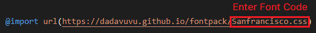

# CustomFont

Apply the font as you like!

## Available Font

 

| Available Font Name | Font Code | Description |
| --- | --- | --- |
| San Francisco | Sanfrancisco.css | This is the default English font provided by Apple. |
| Apple Sandoll Gothic Neo | AppleSDGothicNeo.css | This is the default Korean font provided by Apple. |
| Nanumg Gothic | Nanumgothic.css | This is a popular Korean Gothic font provided by Naver. |
| Nanum Myeongjo | Nanummyeongjo.css | This is a Korean Batang font provided by Naver. |

## Tutorial

